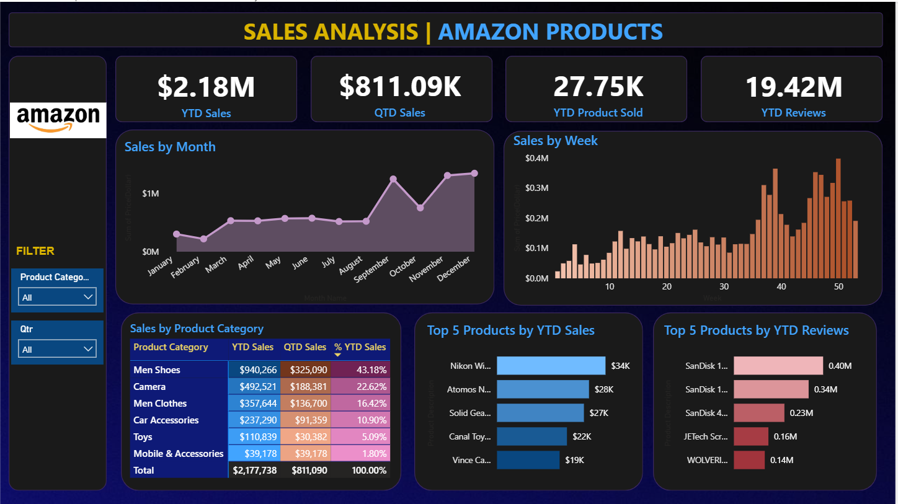

# Amazon-Sales-Analysis-PowerBI
# Amazon Sales Analysis Dashboard | Power BI
## Project Overview
This project is an interactive sales analysis dashboard created using
Microsoft Power BI.
The dashboard provides an overview of Amazon product sales performance,
including sales trends, product categories, product reviews, and top-selling
products.
## Dashboard Preview

## Key Metrics
The dashboard includes the following key performance indicators:
- YTD Sales
- QTD Sales
- YTD Products Sold
- YTD Reviews
## Dashboard Analysis
### Sales by Month
The monthly sales chart shows sales performance throughout the year and
helps identify monthly trends and changes in sales volume.
### Sales by Week
The weekly sales visualization provides a more detailed view of sales
performance across individual weeks.
### Sales by Product Category
The dashboard compares:
- Men Shoes
- Camera
- Men Clothes
- Car Accessories
- Toys
- Mobile & Accessories
The category table displays YTD Sales, QTD Sales, and percentage contribution
to YTD Sales.
### Top 5 Products by YTD Sales
This visual identifies the five products generating the highest YTD sales.
### Top 5 Products by YTD Reviews
This visual highlights products with the highest number of customer reviews.
## Tools & Technologies
- Microsoft Power BI
- Power Query
- DAX
- Microsoft Excel
- GitHub
## Project Features
- Interactive product-category filter
- Quarter filter
- Monthly sales analysis
- Weekly sales analysis
- Category-level performance analysis
- Top 5 products by sales
- Top 5 products by reviews
- KPI cards for business performance
## Dashboard Insights
The dashboard can be used to:
1. Monitor overall sales performance.
2. Compare sales across product categories.
3. Identify high-performing products.
4. Analyze monthly and weekly sales trends.
5. Understand the contribution of individual categories.
6. Identify products receiving significant customer engagement through
   reviews.
## How to Use
1. Download the Power BI `.pbix` file from the `PowerBI` folder.
2. Open the file using Microsoft Power BI Desktop.
3. If required, update the source-data path in Power Query.
4. Refresh the dataset.
5. Use the filters to explore the dashboard.
## Project Structure
```text
amazon-sales-analysis-powerbi/
│
├── README.md
├── PowerBI/
│   └── Amazon_Sales_Analysis.pbix
├── Dataset/
│   └── Amazon_Sales_Data.xlsx
├── Dashboard/
│   └── Amazon_Sales_Dashboard.png
└── Documentation/
    └── Dashboard_Overview.md
## Author
Shubhangi Kumbhare
## License
This project is intended for educational and portfolio purposes.
